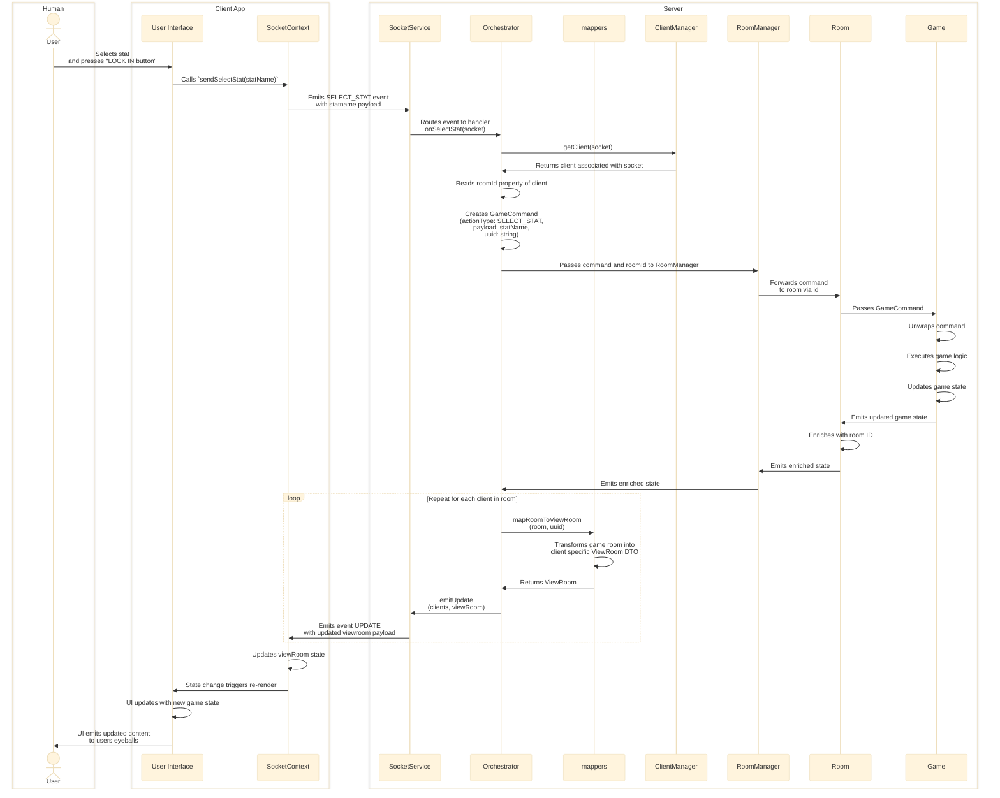

# PokeMatch

PokeMatch is a real-time Pokémon-themed "Top Trumps"-style card matching game for two people.

This is a portfolio project designed to showcase my abilites as a full stack developer. Featuring a React frontend, node.js backend, and socket.io websocket communication for a seamless, real-time multiplayer experience.
<br>
### [🎮 Play Now 🎮](https://pokematch-guii.onrender.com/) ###
<sub>*Note: First load may take 30-60s as the render free-tier server spins up.*</sub>


### Tech Highlights: ### 
* **Full-stack TypeScript, WebSocket architecture, stateful session management, 100+ unit tests with CI/CD pipeline.**
* **Stateful Session Management**: UUID-based client identification enables automatic reconnection with full state restoration, supporting mid-game disconnections without data loss.
* **Headless Bot API**: RESTful endpoint spawns automated opponents using the same client interface, following DRY principles and API-driven architecture. 
* **Monorepo Architecture**: npm workspaces manage shared TypeScript types, constants, and validation logic across client/server, ensuring type safety and eliminating code duplication.

### Server Architecture (Node.js + TypeScript + Express + Socket.IO)

<!--  -->


**Design Patterns:**
- **Command Pattern**: Game actions encapsulated as command objects processed by the core `Game` model
- **Observer Pattern**: Event-driven state propagation via Node.js EventEmitter
- **Mediator Pattern**: Central `Orchestrator` class coordinates between services

**SOLID Principles:**
- Single Responsibility: Each class has one clearly defined purpose
- Dependency Injection: Services receive dependencies via constructor injection
- Interface Segregation: Clients depend only on methods they use

**Key Features:**
- Stateful room and session lifecycle management
- RESTful bot API for headless opponents
- Graceful handling of disconnects/reconnects

**Testing:** 58+ unit and integration tests covering game logic, managers, and full workflows

### Client Architecture (React + TypeScript)

**Core Patterns:**
- **Custom Hooks for Business Logic**: Separation of concerns via hooks like `useBattleLogic` and `useBattleSequence`, keeping components purely presentational
- **Context-Based State Management**: Centralized WebSocket state via custom `useSocketContext` hook, eliminating prop drilling
- **SCSS Modules**: Scoped styling prevents collisions in a component-heavy UI

**Key Features:**
- Persistent sessions via localStorage UUID
- Hardware-accelerated CSS animations for 60fps performance
- Optimistic UI updates with rollback on server conflict

**Testing:** 27+ component and hook tests using Vitest + React Testing Library

### Game Flow Sequence Diagram



### Notes

- **Error Handling**: The above diagram shows the Happy Path only. At multiple points (client validation, room validation, game logic), errors can occur. The system follows a consistent pattern: log the error, emit an error event to the client, and halt processing. The client displays the error to the user.

- **State Synchronization**: After any state change, all clients in the room receive updated `ViewRoom` data via the `UPDATE` event, ensuring UI consistency.


### Running the Application

**Prerequisites:**
- Node.js v20+ (or v18+)
- npm (comes with Node.js)

**Quick Start:**
```bash
# Clone and install
git clone https://github.com/leontutu/PokeMatch
cd PokeMatch
npm install

# Run tests (optional)
npm run test

# Start server (terminal 1)
cd server && npm run dev

# Start client (terminal 2)  
cd client && npm run dev

# In your browser
Open: http://localhost:5173
Simulate 2nd player: Use a different browser or private window
```
