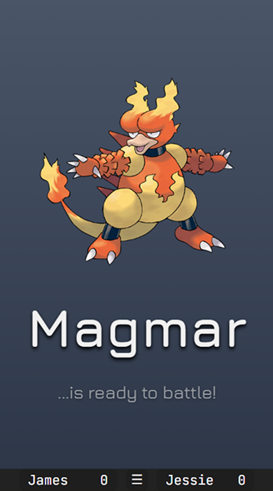
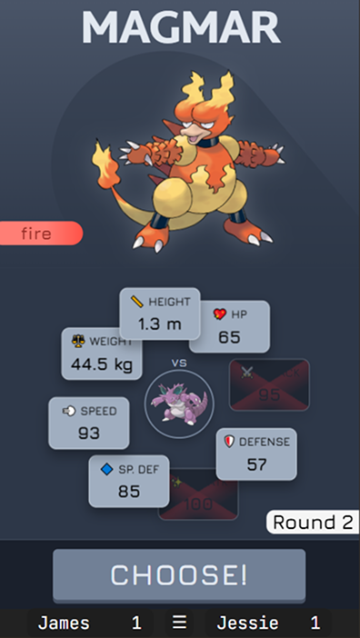
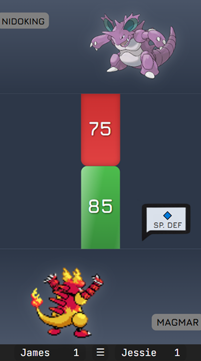
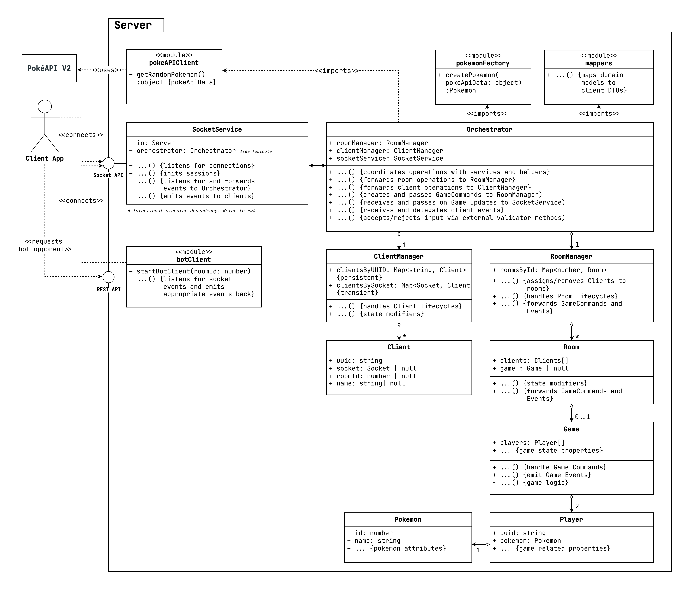
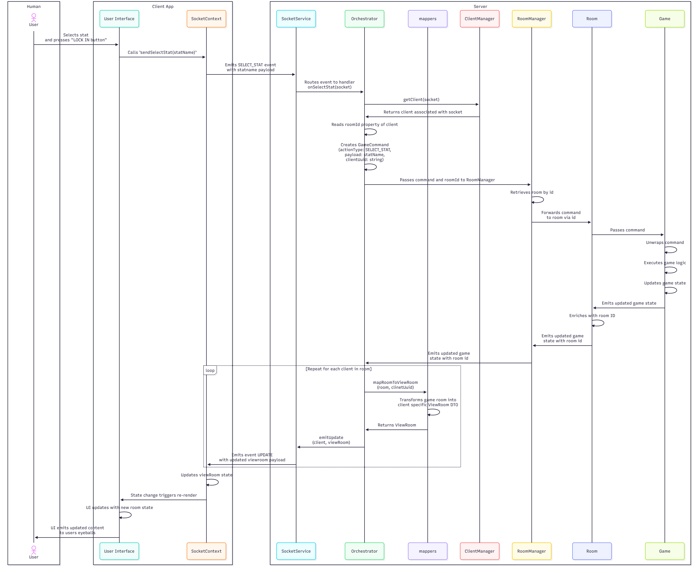

<h1 align="center">⚪ PokeMatch 🔴</h1>

<p align="center">
  
  
  
  
</p>

<p align="center">
  <a href="#️-architecture">🏗️ Architecture</a> •
  <a href="#-tech-stack">💻 Tech Stack</a> •
  <a href="#️-running-locally">⚙️ Setup</a>
</p>

<p align="center">
  <b>A real-time multiplayer game where players challenge each other using Pokémon in a "Top Trumps" showdown.</b>
  <br/>
  <sub>Full-stack TypeScript • Stateful sessions • 100+ unit tests • CI/CD pipeline</sub>
</p>
<p align="center">
  <a href="https://pokematch-guii.onrender.com/" target="_blank">
    
  </a>
  <br/>
  <sub><i>⚠️ First load may take 30-60s as free-tier server wakes up</i></sub>
</p>

<p align="center">
  
  
  
</p>

<p align="center">
This is a portfolio project designed to showcase my abilites as a full stack developer.
</p>

---

## ⚡ Tech Highlights: 
* **Full-stack TypeScript, WebSocket architecture, stateful sessions, 100+ unit tests with CI/CD pipeline.**
* **Stateful Session Management**: UUID-based client identification enables automatic reconnection with full state restoration, supporting mid-game disconnections without data loss.
* **Headless Bot API**: RESTful endpoint spawns autonomous opponents, connecting to the server socket interface as regular clients.
* **Monorepo Architecture**: npm workspaces manage shared TypeScript type aliases, constants, and validation logic across client/server, eliminating API contract bugs.

---

## 🏗️ Architecture

### Server Archtitecture
<!--  -->
<details>
  <summary>Architecture Diagram (simplified)</summary>
  
</details>

**Design Patterns:**
- **Mediator Pattern**: Central `Orchestrator` class coordinates between services
- **Observer Pattern**: Event-driven state propagation via Node.js EventEmitter
- **Command Pattern**: Game actions encapsulated as command objects processed by the core `Game` model

**SOLID Principles:**
- **Single Responsibility**: Each class has one clearly defined purpose
- **Dependency Injection**: Pure DI of services via constructor injection
- **Interface Segregation**: Clients depend only on methods they use

**Key Features:**
- Stateful room and session lifecycle management
- RESTful bot API for headless opponents
- Graceful handling of disconnects/reconnects
- Robust defensive programming checks and guards 

**Testing:** 58+ unit and integration tests covering game logic, managers, and full workflows

---

### Client Architecture 

**Core Patterns:**
- **Custom Hooks for Business Logic**: Separation of concerns via hooks like `useBattleLogic` and `useBattleSequence`, keeping components purely presentational
- **Context-Based State Management**: Centralized WebSocket state via custom `useSocketContext` hook, eliminating prop drilling
- **SCSS Modules**: Scoped styling prevents collisions in a component-heavy UI

**Key Features:**
- Persistent sessions via localStorage UUID
- Real-time state synchronization across all clients via WebSocket events
- Optimistic UI updates with server-side validation and conflict resolution
- Component-driven architecture with custom hooks for clean separation of concerns

**Testing:** 27+ component and hook tests using Vitest + React Testing Library


---
<details>
<summary><h3>Example Gameflow Sequence Diagram</h3></summary>
  
  #### Notes

  - **Error Handling**: The above diagram shows the Happy Path only. At multiple points (client validation, room validation, game logic), errors can occur. The system follows a consistent pattern: log the error, emit an error event to the client, and halt processing. The client displays the error to the user.

  - **State Synchronization**: After any state change, all clients in the room receive personalized updated `ViewRoom` data via the `UPDATE` event, ensuring UI consistency.
</details>


---

## 📒 Development Journey

This project was built over 2 months with 250+ commits and 30+ feature branches, showcasing:

- Feature branch workflow with descriptive commit messages
- Planning and tracking of tasks through detailed Issues
- Continuous refactoring based on learnings
- JavaScript to TypeScript, CSS to SCSS migrations

What started as a sandbox weekend project evolved into a production-ready multiplayer game with comprehensive testing, CI/CD, and scalable architecture.

[Link to commit history](https://github.com/leontutu/pokematch/commits)

---

## 💻 Tech Stack

<table>
<tr>
<td width="50%" valign="top">

#### Frontend
-  Component-based UI library
-  Type-safe JavaScript
-  Fast build tool and dev server
-  CSS preprocessor

#### Backend
-  JavaScript runtime
-  Web server framework
-  Type-safe JavaScript

#### Communication
-  Real-time bidirectional events
-  Stateless request-response

</td>
<td width="50%" valign="top">


#### Testing
-  Fast unit test runner
-  Component testing utilities

#### DevOps & Tooling
-  Version control
-  CI/CD pipeline
-  Monorepo management
-  Code quality
-  Cloud hosting

</td>
</tr>
</table>

### ⚙️ Running locally

**Prerequisites:**
- Node.js v20+ (or v18+)
- npm (comes with Node.js)

**Quick Start:**
```bash
# Clone and install
git clone https://github.com/leontutu/PokeMatch
cd PokeMatch
npm install

# Run tests (optional)
npm run test

# Start server (terminal 1)
npm run dev:server

# Start client (terminal 2)  
npm run dev:client

# In your browser
Open: http://localhost:5173
Simulate 2nd player: Use a different browser or private window
```
