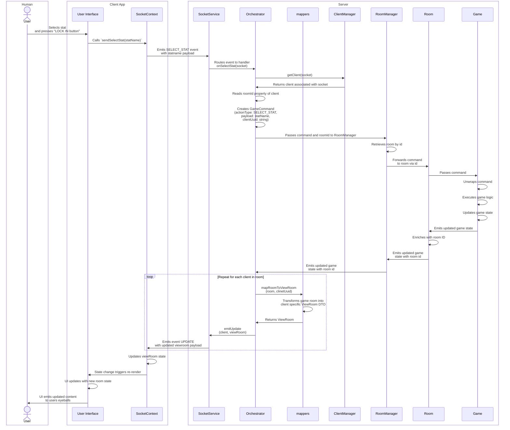

```mermaid
sequenceDiagram
  box Human
    actor User as User
  end
  box Client App
    participant UI as User Interface
    participant Hook as SocketContext
  end
  box Server
    participant Server as SocketService
    participant Orchestrator as Orchestrator
    participant MapperService as mappers
    participant ClientManager as ClientManager
    participant RoomManager as RoomManager
    participant Room as Room
    participant Game as Game
  end
  User ->> UI: Selects stat<br/>and presses "LOCK IN button"
  UI ->> Hook: Calls `sendSelectStat(statName)`
  Hook ->> Server: Emits SELECT_STAT event<br/> with statname payload
  Server ->> Orchestrator: Routes event to handler <br/> onSelectStat(socket)
  Orchestrator ->> ClientManager: getClient(socket)
  ClientManager ->> Orchestrator: Returns client associated with socket
  Orchestrator ->> Orchestrator: Reads roomId property of client
  Orchestrator ->> Orchestrator: Creates GameCommand<br/>(actionType: SELECT_STAT,<br/>payload: statName,<br/>clientUuid: string) 
  Orchestrator ->> RoomManager: Passes command and roomId to RoomManager
  RoomManager ->> RoomManager: Retrieves room by id
  RoomManager ->> Room: Forwards command<br/>to room via id
  Room ->> Game: Passes command
  Game ->> Game: Unwraps command
  Game ->> Game: Executes game logic
  Game ->> Game: Updates game state
  Game ->> Room: Emits updated game state
  Room ->> Room: Enriches with room ID
  Room ->> RoomManager: Emits updated game<br/>state with room id
  RoomManager ->> Orchestrator: Emits updated game<br/>state with room id
  loop Repeat for each client in room
    Orchestrator ->> MapperService: mapRoomToViewRoom<br/>(room, clinetUuid)
    MapperService ->> MapperService: Transforms game room into<br/>client specific ViewRoom DTO
    MapperService ->> Orchestrator: Returns ViewRoom
    Orchestrator ->> Server: emitUpdate<br>(client, viewRoom)
    Server ->> Hook: Emits event UPDATE<br/>with updated viewroom payload
  end
  Hook ->> Hook: Updates viewRoom state
  Hook ->> UI: State change triggers re-render
  UI ->> UI: UI updates with new room state
  UI ->> User: UI emits updated content<br/>to users eyeballs
```